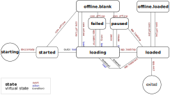

# Cordova Web Wrap

This app is a light-weight [Cordova](http://cordova.apache.org/) wrapper around a
mobile website. It can be useful to add functionality that only works in apps, like
barcode scanning, to a mobile website. While Cordova does a lot to make this possible,
a polished, well-working app is not yet trivial. This project simplifies that.

Note that it's best to create a [single page application](https://en.wikipedia.org/wiki/Single-page_application),
so that the website code only needs to be loaded once. This allows the user to have
fast interaction with the app.

Features:

- Loads the website in an app, safely (inAppBrowser).
- Meant for [single page applications](https://en.wikipedia.org/wiki/Single-page_application).
- Works when online, a notice is shown when offline (with a state-machine to track state).
- Opens external links in the system web browser, internal links in the app.
- Website can indicate which links to open in the app.
- Allows scanning a barcode, initiated from the website.
- Works on Android and iOS.

## Build

1. [Install Cordova](http://cordova.apache.org/docs/en/latest/guide/cli/index.html): `npm install -g cordova`
2. [Add platforms](https://cordova.apache.org/docs/en/latest/guide/cli/index.html#add-platforms): `cordova platform add android` and/or `cordova platform add ios`.
3. [Check (and install) requirements](https://cordova.apache.org/docs/en/latest/guide/cli/index.html#install-pre-requisites-for-building): `cordova requirements`
4. [Build](https://cordova.apache.org/docs/en/latest/guide/cli/index.html#build-the-app): `cordova build`

### iOS

On iOS `cordova build ios` may not be enough. After running this, you can open the folder `platforms/ios` in Xcode.
In the warnings shown there are two items about updating build settings. Accept the modifications (ignoring the warning
about uncommited changes), and build it from Xcode.

## Configure

- Change `LANDING_URL` in [`www/js/index.js`](www/js/index.js#L21) to point to your mobile website.
- Update `id`, `name`, `description` and `author` in [`config.xml`](config.xml) ([reference](https://cordova.apache.org/docs/en/latest/config_ref/)).
- Modify `name`, `displayName`, `description` and `author` in [`package.json`](package.json).
- Edit `title`, `h1` and other texts in [`www/index.html`](www/index.html).

Then build and install.
If you want more beautiful icons (recommended), run

    npm install cordova-icon
    node_modules/.bin/cordova-icon --icon=res/icon.png

To use your own icons, update [`res/icon.png`](res/icon.png) and [`www/img/logo.png`](www/img/logo.png) before doing so.

## State machine

This app uses a state machine ([machina](https://github.com/ifandelse/machina.js)) to keep track of
connection and loading state. The state diagram is as follows:



## Opening external links

External links are opened in the system web browser, internal links in the app.
Which links are internal is determined by `LOCAL_URLS` in [index.js](www/js/index.js#L26),
which is a space-separated list of URLs. All listed links are considered to be internal.
Full URLs are allowed (to allow multiple hosts), as are URLs relative to the
host (and protocol) of `LANDING_URL`, with leading slash. Query string and hash are
not part of the comparison.

For example, if you have a mobile website where you want to open the index, an about
page, and product pages, you could use `/ /about /products/*`. All other
links on your website would be opened in the system web browser.

This attribute can also be set by the website by any element with a `data-app-local-urls`
attribute (so the website can evolve without having to update this setting in the app).

It may be useful to know that there are two ways in which this is implemented. The first
one applies to `a` elements only. After a page has loaded, an event listener is installed
which disables navigation for external links and invokes the system web browser. The second
method kicks in when a script navigates to an external link (e.g. an embedded Google Map),
but this only happens _after_ the internal web browser has started loading the URL. This
request is then cancelled.

Please note that this last method triggered various subtle issues on iOS (and to a lesser
extent on Android), which have been worked around where possible, but it remains tricky.
So: be careful when opening pages from Javascript (work is
[on the way](https://issues.apache.org/jira/browse/CB-14188) to improve this).

## Barcode scanner

The website can initiate a barcode scan by pointing to the custom url `app://mobile-scan`.
When this link is followed, the barcode scanner is opened. On successful scan, it will return
to the page indicated by the `ret` query string parameter passed that triggered opening the
scanner. This is a [URL template](https://en.wikipedia.org/wiki/URL_Template) where `{CODE}` is
replaced by the scanned barcode. Links can be relative or absolute.

An example. When following the link in the HTML shown below, a barcode scanner will
be opened, and when barcode `12345` is scanned, the link `http://x.test/scan/12345`
will be opened in the app.

```html
<a href="app://mobile-scan?ret=http%3A%2F%2Fx.test%2Fscan%2F%7BCODE%7D">
  Scan
</a>
```

## Adapating a website for the app

This app shows a mobile website. Most of it would also work in a regular web browser, but
certain features may only make sense when embedded in the app. The barcode-scan feature
comes to mind, and it may be desirable to hide large documentation pages from navigation.

This can easily be done in two ways:
1. _User-Agent_ - the `AppendUserAgent` preference in `config.xml` can be used to modify
  the user-agent. The website can show and hide certain elements based on this.
2. `LANDING_URL` - the app's landing page could include a query parameter or be a specific
  page for the app. It can be useful to pass through the query parameter to links, so that
  any modified navigation remains so in the app.

## Testing on the emulator

To test the barcode scanner with the Android emulator, you can use the following
procedure on Linux (based on [this](https://stackoverflow.com/a/35526103/2866660)).

```sh
# Check which video devices are available. Use the next number for 'video_nr' and in 'device'.
$ ls /dev/video*
/dev/video0
# Load the loopback video device
$ sudo modprobe v4l2loopback video_nr=1 card_label="mockcam"
# Create virtual webcam out of the image, substitute 'image.png' with your picture.
$ gst-launch-1.0 filesrc location=image.png ! pngdec ! imagefreeze ! v4l2sink device=/dev/video1
```

Then launch the emulator with the additional argument `-camera-back webcam1` (use same number
as above). You may want to scale the image to 800x600 if you have a large one. One online
barcode generator is [this one](https://floms.github.io/Open-Barcode/).

## Lodash

The state machine requires [lodash](https://lodash.com/), and to reduce the footprint we
use a custom build (527K to 132K for version 4.17.5). The methods included are just those used
in the [state machine code](www/js/machina.js) plus `debounce` (so if you get missing functions
there after a machina upgrade, check if a missing method is used):

    npm install -g lodash-cli
    lodash -d -o www/js/lodash.custom.js include=apply,defaults,cloneDeep,debounce,difference,each,extend,filter,isPlainObject,merge,transform,without

## Notes

- Opening external links can be improved after [CB-14188](https://issues.apache.org/jira/browse/CB-14188) is implemented.
- A [custom inAppBrowser](https://github.com/q-m/cordova-plugin-inappbrowser/tree/feature/allowedschemes-ios) is used that
  supports `AllowedSchemes` on iOS, it can be reverted to the official plugin when
  [CB-14187](https://issues.apache.org/jira/browse/CB-14187) / [PR #274](https://github.com/apache/cordova-plugin-inappbrowser/pull/274)
  is released.
- If the inAppBrowser would support opening external links without messing up the internal inAppBrowser, the
  app-launcher plugin could be removed (see also [CB-13198](https://issues.apache.org/jira/browse/CB-13198)).
- On iOS, opening the barcode scanner briefly shows a _opening barcode scanner_ screen because of
  [this issue](https://github.com/phonegap/phonegap-plugin-barcodescanner/issues/570) (marked _wontfix_).

## Links

* [Going Mobile: Wrapping an existing web application in Cordova/Phonegap](https://medium.com/code-divoire/going-mobile-wrapping-an-existing-web-application-in-cordova-phonegap-106d8b60bb9a)
* [HTML-5 Cordova webapp](https://github.com/krisrak/html5-cordova-webapp/)
* [Is This Thing On?](https://www.telerik.com/blogs/is-this-thing-on-(part-1)), on state management for connection status
* [Cordova documentation](https://cordova.apache.org/docs/en/latest/)
